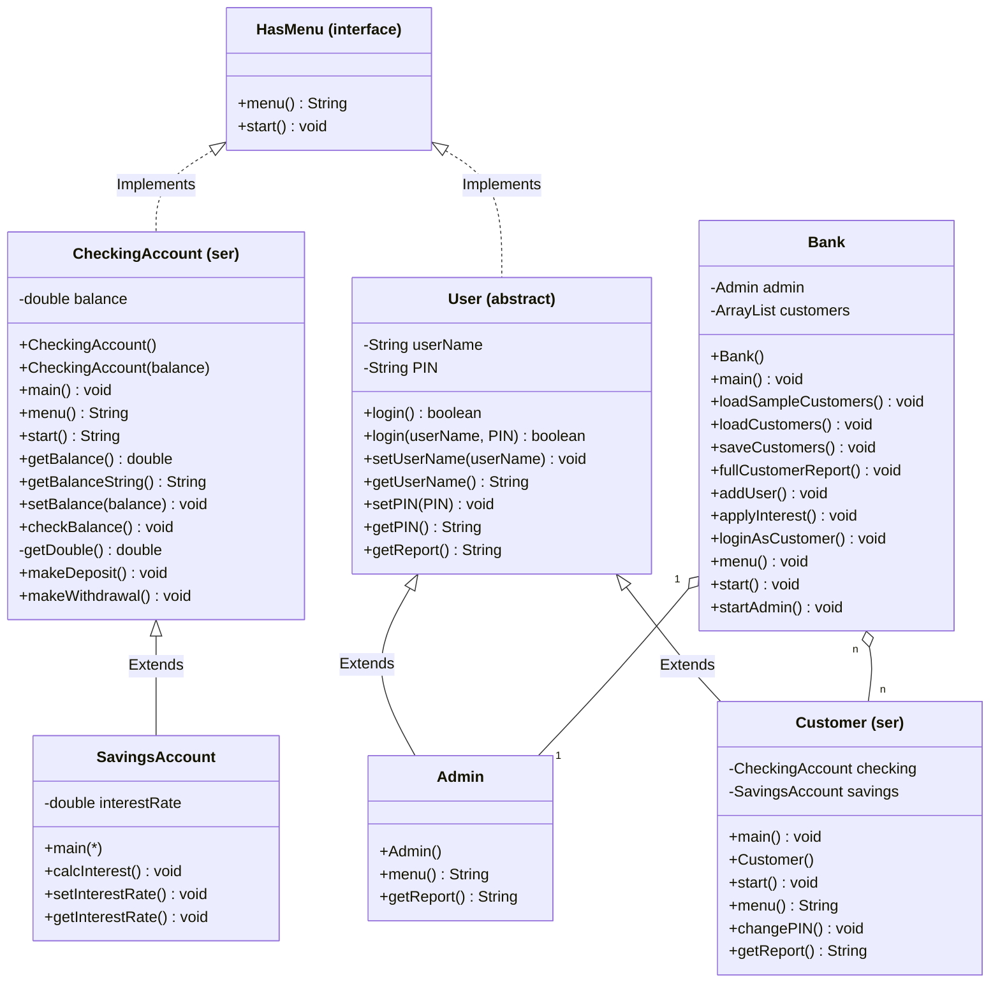

# CompSci121BankOnItPt2

```mermaid
classDiagram
    class HasMenu["HasMenu (interface)"] {
        +menu() String
        +start() void
    }

    class CheckingAccount["CheckingAccount (ser)"] {
        -double balance
        +CheckingAccount()
        +CheckingAccount(balance)
        +main() void
        +menu() String
        +start() String
        +getBalance() double
        +getBalanceString() String
        +setBalance(balance) void
        +checkBalance() void
        -getDouble() double
        +makeDeposit() void
        +makeWithdrawal() void
    }

    class SavingsAccount {
        -double interestRate
        +main(*)
        +calcInterest() void
        +setInterestRate() void
        +getInterestRate() void
    }

    class User["User (abstract)"] {
        -String userName
        -String PIN
        +login() boolean
        +login(userName, PIN) boolean
        +setUserName(userName) void
        +getUserName() String
        +setPIN(PIN) void
        +getPIN() String
        +getReport() String
    }

    class Admin {
        +Admin()
        +menu() String
        +getReport() String
    }

    class Customer["Customer (ser)"] {
        -CheckingAccount checking
        -SavingsAccount savings
        +main() void
        +Customer()
        +start() void
        +menu() String
        +changePIN() void
        +getReport() String
    }

    class Bank {
        -Admin admin
        -ArrayList customers
        +Bank()
        +main() void
        +loadSampleCustomers() void
        +loadCustomers() void
        +saveCustomers() void
        +fullCustomerReport() void
        +addUser() void
        +applyInterest() void
        +loginAsCustomer() void
        +menu() void
        +start() void
        +startAdmin() void
    }

    HasMenu <|.. CheckingAccount : Implements
    HasMenu <|.. User : Implements
    CheckingAccount <|-- SavingsAccount : Extends
    User <|-- Admin : Extends
    User <|-- Customer : Extends
    Bank "1" o-- "1" Admin
    Bank "n" o-- "n" Customer
```
