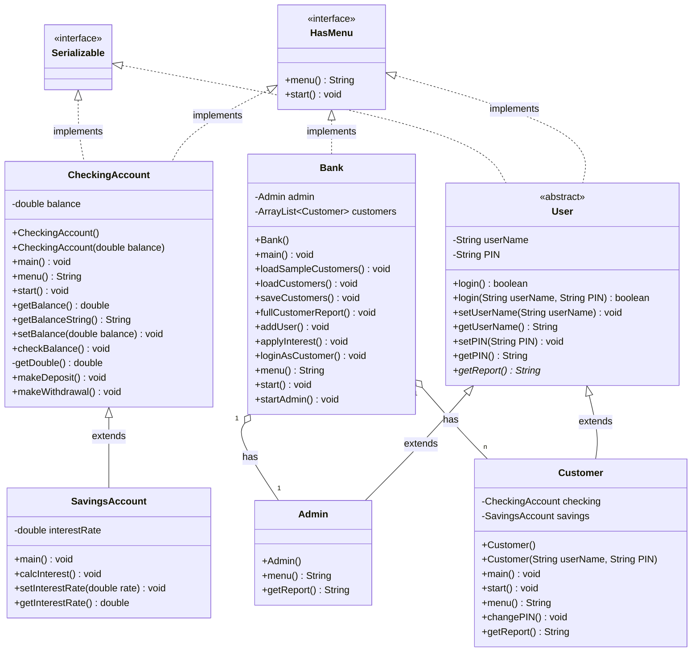

# CompSci121BankOnItPt2

```mermaid
classDiagram
    class HasMenu {
        <<interface>>
        +menu() String
        +start() void
    }

    class Serializable {
        <<interface>>
    }

    class CheckingAccount {
        -double balance
        +CheckingAccount()
        +CheckingAccount(double balance)
        +main() void
        +menu() String
        +start() void
        +getBalance() double
        +getBalanceString() String
        +setBalance(double balance) void
        +checkBalance() void
        -getDouble() double
        +makeDeposit() void
        +makeWithdrawal() void
    }

    class SavingsAccount {
        -double interestRate
        +main() void
        +calcInterest() void
        +setInterestRate(double rate) void
        +getInterestRate() double
    }

    class User {
        <<abstract>>
        -String userName
        -String PIN
        +login() boolean
        +login(String userName, String PIN) boolean
        +setUserName(String userName) void
        +getUserName() String
        +setPIN(String PIN) void
        +getPIN() String
        +getReport()* String
    }

    class Admin {
        +Admin()
        +menu() String
        +getReport() String
    }

    class Customer {
        -CheckingAccount checking
        -SavingsAccount savings
        +Customer()
        +Customer(String userName, String PIN)
        +main() void
        +start() void
        +menu() String
        +changePIN() void
        +getReport() String
    }

    class Bank {
        -Admin admin
        -ArrayList~Customer~ customers
        +Bank()
        +main() void
        +loadSampleCustomers() void
        +loadCustomers() void
        +saveCustomers() void
        +fullCustomerReport() void
        +addUser() void
        +applyInterest() void
        +loginAsCustomer() void
        +menu() String
        +start() void
        +startAdmin() void
    }

    HasMenu <|.. CheckingAccount : implements
    HasMenu <|.. User : implements
    HasMenu <|.. Bank : implements
    Serializable <|.. CheckingAccount : implements
    Serializable <|.. User : implements
    CheckingAccount <|-- SavingsAccount : extends
    User <|-- Admin : extends
    User <|-- Customer : extends
    Bank "1" o-- "1" Admin : has
    Bank "1" o-- "n" Customer : has
```
